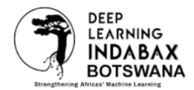

<p align="center">
  
</p>

<h1 align="center">Exploratory Data Analysis &amp; Machine Learning in Python</h1>

<p align="center">
  <b>A hands-on workshop by Deep Learning IndabaX Botswana</b><br/>
  <i>Our Data. Our Intelligence. Our Future.</i>
</p>

<p align="center">
  
  
  
  
</p>

---

## About this project

This repository holds the full teaching materials for a community workshop that takes participants from **Exploratory Data Analysis (EDA)** through to their **first Machine Learning (ML) models**, entirely in Python. It is designed for beginner-friendly, hands-on sessions where everyone codes along.

The materials are built around a simple but important idea:

> **EDA is not merely a warm-up for machine learning — it is the stage where most ML problems first become visible.** The missing values, the outliers, the sudden shocks and the hidden group differences we uncover while exploring are exactly the things that later make or break a model.

Rather than generic toy examples, the notebooks use **regional employment data for Botswana and Zimbabwe** (unemployment, employment and labour participation across cities/regions during 2020), so the techniques land in a familiar, local context.

---

## How the workshop runs

Two hands-on sessions, **9:00 – 11:00**, each pairing a short presentation with practical coding:

| Time | Session | Presentation | Hands-on practice |
|---|---|---|---|
| 9:00 – 9:55 | **Session 1 — Exploratory Data Analysis** | 25 min | 30 min |
| 9:55 – 10:10 | **Break** | — | — |
| 10:10 – 11:00 | **Session 2 — Machine Learning** | 20 min | 30 min |

Slides for both sessions (plus a Setswana welcome and thank-you) are in `Workshop_Deck_IndabaX.pptx`.

---

## What's inside

### Teaching notebooks (work through these first)

| File | What it covers |
|---|---|
| `EDA_in_Python_All_Chapters_Botswana.ipynb` | The complete EDA walkthrough — getting to know a dataset, data cleaning, relationships, and turning analysis into action — applied to the Botswana data. |
| `ML_in_Python_Botswana.ipynb` | The core supervised-learning workflow — framing a problem, train/test split, regression (Linear → Random Forest), evaluation (MAE, RMSE, R²), classification, and cross-validation. |

### Practice notebooks (fill-in-the-gap challenges)

Each challenge comes as a **questions** notebook (blanks marked `____` with hints, for participants) and a matching **answers** notebook (the completed key, for facilitators). They are themed to keep things fun — a "Data Detective" mystery for EDA and a "Prediction Challenge" for ML.

| Challenge | Dataset | Questions | Answers |
|---|---|---|---|
| EDA basics | Botswana | `EDA_Botswana_PRACTICE_questions.ipynb` | `EDA_Botswana_PRACTICE_answers.ipynb` |
| EDA basics | Zimbabwe | `EDA_Zimbabwe_PRACTICE_questions.ipynb` | `EDA_Zimbabwe_PRACTICE_answers.ipynb` |
| ML basics | Zimbabwe | `ML_Zimbabwe_PRACTICE_questions.ipynb` | `ML_Zimbabwe_PRACTICE_answers.ipynb` |

### Datasets

| File | Description |
|---|---|
| `botswana_unemployment_2020.csv` | 27 Botswana cities × 10 monthly snapshots (Jan–Oct 2020). |
| `zimbabwe_unemployment_2020.csv` | 27 Zimbabwe cities × 10 monthly snapshots (Jan–Oct 2020). |

Both share the same columns:

`Region, Date, Frequency, Estimated Unemployment Rate (%), Estimated Employed, Estimated Labour Participation Rate (%), Zone, longitude, latitude`

Each row is one city in one month, with correct latitude/longitude so the data can be mapped. A COVID-19 lockdown shock is visible around April 2020, and city-level patterns (e.g. tourism towns hit hardest, remote regions with higher baseline unemployment) give learners a real story to discover.

> ⚠️ **Note on the data:** These datasets are **realistically simulated** for teaching purposes. They are ideal for learning the techniques, but they are **not** official statistics and should not be used to draw real conclusions about the Botswana or Zimbabwe labour markets.

### Slides & assets

| File | Description |
|---|---|
| `Workshop_Deck_IndabaX.pptx` | The workshop slide deck (Welcome, schedule, sharing slide, Thank-you). |
| `botswana_employment_map_preview.png` | A preview map of Botswana employment by city. |
| `indabax_botswana_logo.png` | Deep Learning IndabaX Botswana logo. |

---

## Getting started

You can run everything in the cloud (no installation) or locally.

### Option A — Google Colab (easiest)

1. Open [Google Colab](https://colab.research.google.com/) and upload a notebook.
2. Run the first cell; when prompted, upload the matching `.csv` from this repo.
3. Run the cells top to bottom.

### Option B — Run locally

```bash
# 1. Clone the repository
git clone https://github.com/YOUR-USERNAME/YOUR-REPO.git
cd YOUR-REPO

# 2. (Optional) create a virtual environment
python -m venv venv
source venv/bin/activate      # on Windows: venv\Scripts\activate

# 3. Install the requirements
pip install pandas numpy matplotlib seaborn scikit-learn jupyter plotly

# 4. Launch Jupyter
jupyter notebook
```

Keep each notebook in the same folder as its dataset, then run the cells top to bottom (in Jupyter: **Kernel → Restart & Run All**).

---

## Suggested learning path

1. **Start with EDA** — work through `EDA_in_Python_All_Chapters_Botswana.ipynb`.
2. **Practise** — try `EDA_Botswana_PRACTICE_questions.ipynb` (or the Zimbabwe version), checking against the answer key.
3. **Move to ML** — work through `ML_in_Python_Botswana.ipynb`.
4. **Practise again** — try `ML_Zimbabwe_PRACTICE_questions.ipynb`.

---

## Requirements

- Python 3.9+
- `pandas`, `numpy`, `matplotlib`, `seaborn`, `scikit-learn`, `jupyter`, `plotly`

---

## Acknowledgements

Built for the community by **Deep Learning IndabaX Botswana**, in partnership with **IndabaX Zimbabwe** and **Data Science Zimbabwe**, as part of the broader Deep Learning Indaba movement to strengthen machine learning across Africa.

Workshop led by **Walter Nyamutamba**.

---

## License

Unless stated otherwise, the materials in this repository are released under the
**Creative Commons Attribution 4.0 International (CC BY 4.0)** license — you are free to share and adapt them for your own community, with attribution.

---

<p align="center"><i>Our Data. Our Intelligence. Our Future.</i></p>
